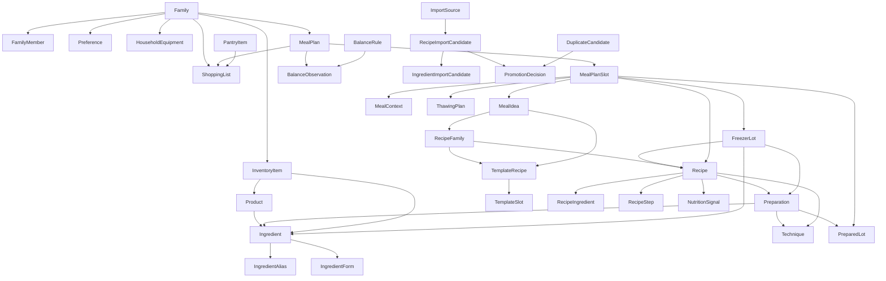

# 04 - Relationships

Generated: 2026-06-26

This document describes domain relationships, not database foreign keys.

The mental load test for every relationship is: does connecting these concepts help the family decide, shop, cook, thaw, reuse, or avoid duplicate maintenance with less effort?

## Relationship Principles

1. Relationships should support decisions the family actually makes.
2. Canonical data should not depend on unreviewed import data.
3. Recipes, inventory, shopping, and planning must connect, but should not own each other.
4. A meal plan slot may point to different kinds of meal sources: recipe, meal idea, leftover, freezer lot, or placeholder.
5. Families and contexts scope recommendations.

## High-Level Relationship Map

## Household Relationships

### Family to FamilyMember

Relationship:

- One family has many family members.

Why it matters:

- Meal planning depends on who is eating.

### FamilyMember to DiningProfile

Relationship:

- One member can have one active dining profile and historical profiles.

Why it matters:

- A child's preferences and nutritional needs change.

### Preference Targets

A preference may target:

- Ingredient.
- Ingredient form.
- Product.
- Recipe.
- Recipe family.
- Technique.
- Texture.
- Meal context.
- Meal slot.

Why this is broad:

- "Dislikes spinach" and "does not like creamy textures" are different.
- "Avoid frying on weekdays" targets technique/context, not ingredient.

## Ingredient And Product Relationships

### Ingredient to IngredientAlias

Relationship:

- One ingredient has many aliases.

Examples:

- `tomàquet xerri`
- `tomate cherry`
- `cherry tomato`
- `cherry tomatoes`

Why it matters:

- Imports and shopping should converge to one canonical ingredient.

### Ingredient to IngredientForm

Relationship:

- One ingredient may have multiple forms.

Examples:

- Ginger: fresh, dry, powder.
- Tomato: whole, cherry, crushed, sauce.

Rule:

- Use a form when storage, substitution, use, or shopping changes.

### Product to Ingredient

Relationship:

- A product maps to one or more ingredients.

Examples:

- Oreo maps to biscuit/cocoa/cream at a conceptual level, but may remain a product for shopping.
- Lacasitos should likely be a product or branded ingredient.

Rule:

- Do not over-normalize branded products unless the family benefits.

## Preparation Relationships

### Preparation to Ingredient

Relationship:

- A preparation uses ingredients.

Examples:

- Bechamel uses milk, flour, butter.
- Vinaigrette uses oil, vinegar, seasoning.

### Preparation to PreparedLot

Relationship:

- A preparation can produce stored inventory.

Examples:

- Homemade stock frozen in portions.
- Tomato sauce in jars.
- Caramelised onion in fridge/freezer.

### Preparation to Recipe

Relationship:

- A recipe can use a preparation.

Examples:

- Canelons use bechamel.
- Pizza uses tomato sauce and dough.
- Lemon pie uses merengue.

## Recipe Family Relationships

### RecipeFamily to Recipe

Relationship:

- A family groups recipes, variants, versions, or related meal ideas.

Examples:

- `Bacallà`: bacallà with samfaina, crespells, seques.
- `Canelons de carbassó`: seafood variant, cheese variant.

### RecipeFamily to TemplateRecipe

Relationship:

- A family may have a template that defines its structure.

Example:

- Spring rolls family has a template with wrapper, protein, vegetables, sauce, cooking method.

### TemplateRecipe to TemplateSlot

Relationship:

- A template has many slots.

Slot examples:

- Protein.
- Sauce.
- Filling.
- Wrapper.
- Side.
- Technique.
- Timing.

### RecipeVariant to TemplateSlot

Relationship:

- A variant fills or overrides slots.

Example:

- `Rotllets de primavera amb pavo` fills protein with turkey.

## Technique And Equipment Relationships

### Technique to Equipment

Relationship:

- A technique may require or prefer equipment.

Examples:

- Air fryer technique requires air fryer.
- Steam technique may require vaporera.
- Emulsify may require hand blender.

Recommendation:

- Recipes should usually link to techniques.
- Techniques should link to equipment.
- Recipes may also link directly to equipment for exceptional tools.

Why:

- This avoids duplicating equipment rules in every recipe.

## Inventory Relationships

### InventoryItem to Ingredient/Product/Preparation

Relationship:

- Inventory can represent a canonical ingredient, a product, or a prepared item.

Examples:

- Carrots in fridge: Ingredient.
- Oreo packet: Product.
- Homemade stock: Preparation/PreparedLot.

### FreezerLot to Recipe/Ingredient/Preparation

Relationship:

- A freezer lot can contain raw ingredients, cooked recipe portions, or prepared bases.

Why it matters:

- FEFO and thawing need lot-level identity.

### InventoryPolicy to Ingredient/Product/Preparation

Relationship:

- Policies define tracking behavior.

Examples:

- Salt: pantry staple, approximate tracking.
- Chicken breast: perishable/freezer tracking.
- Milk: recurring purchase.

## Meal Planning Relationships

### MealPlan to MealPlanSlot

Relationship:

- A plan contains dated meal slots.

### MealPlanSlot to Recipe

Use when:

- A complete recipe is planned.

### MealPlanSlot to MealIdea

Use when:

- The family knows the meal concept but not the full recipe.

Example:

- `Amanida amb pit de pollastre a la planxa`.

### MealPlanSlot to FreezerLot

Use when:

- The plan is explicitly to use a frozen batch or ingredient.

### MealPlanSlot to MealContext

Use when:

- The slot has constraints: hot weather, guests, lunchbox, busy day, children helping.

## Shopping Relationships

### ShoppingListItem Source Links

A shopping item may come from:

- Low pantry stock.
- Meal plan recipe.
- Meal idea.
- Freezer restock.
- Recurring purchase.
- Manual entry.

Why preserve source:

- It helps explain why the item is on the list.
- It helps avoid duplicate entries.

## Balance And Nutrition Relationships

### Recipe to NutritionSignal

Relationship:

- A recipe can carry approximate traffic-light signals.

Examples:

- Rich dessert: orange/red.
- Vegetable soup: green.

### Recipe/MealIdea to Balance Role

Relationship:

- A recipe or idea can contribute to fish, chicken, meat, eggs, legumes, vegetables, fruit, water.

Why include MealIdea:

- Many XupXup meal ideas still matter for weekly balance.

### MealPlan to BalanceObservation

Relationship:

- A plan can be evaluated against rules.

Output:

- Soft warnings, not hard blocks.

## Import Relationships

### ImportSource to Candidates

Relationship:

- One import source produces many recipe/ingredient candidates.

### Candidate to PromotionDecision

Relationship:

- Every canonical promotion should be explainable.

Decisions:

- Promote to Recipe.
- Convert to MealIdea.
- Merge with existing Recipe.
- Attach as Variant.
- Attach to Template.
- Reject.

## AI Readiness Check

Question: "I have chicken, tomatoes and zucchini. What can I cook?"

Needs:

- Ingredient aliases.
- Inventory items.
- Recipe ingredients.
- Meal ideas.
- Template slots.

Question: "I have 15 minutes."

Needs:

- Recipe time/effort.
- Technique effort.
- Meal ideas.
- Context.

Question: "What should I thaw for tomorrow?"

Needs:

- Meal plan.
- Freezer lots.
- Thawing plan.
- Kitchen knowledge.

Question: "I have too many courgettes."

Needs:

- Inventory quantity/level.
- Ingredient aliases.
- Recipes/templates using carbassó.
- Meal contexts.

Question: "What can Cora help me prepare?"

Needs:

- Family member profile.
- Technique/equipment safety.
- Recipe steps marked by difficulty/help suitability.

Question: "What recipes are good for hot weather?"

Needs:

- MealContext.
- Recipe family/template tags.
- Seasonality and temperature context.

Question: "What can I cook without shopping?"

Needs:

- Inventory.
- Pantry staples.
- Recipe ingredients.
- Substitutions.
- Meal ideas.

Conclusion:

- The model supports these questions if MealIdea, TemplateRecipe, InventoryPolicy, MealContext, and KitchenKnowledge are first-class concepts.
